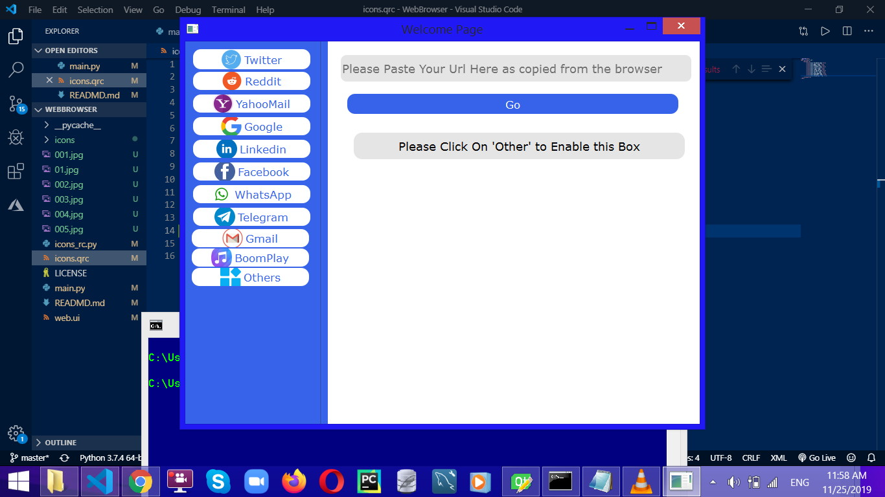
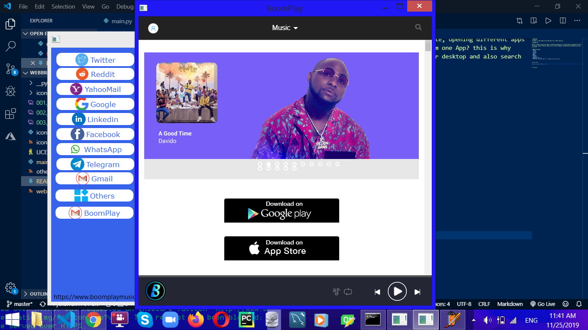
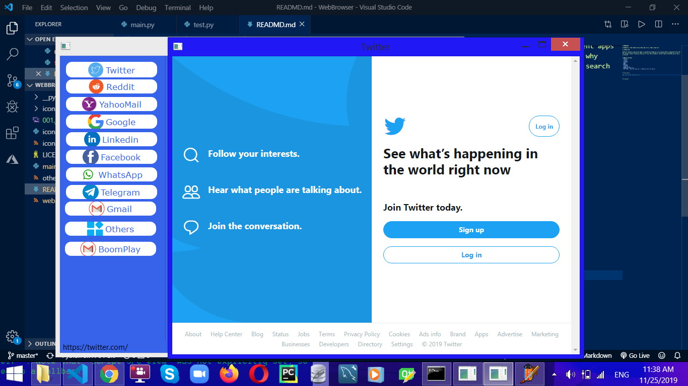
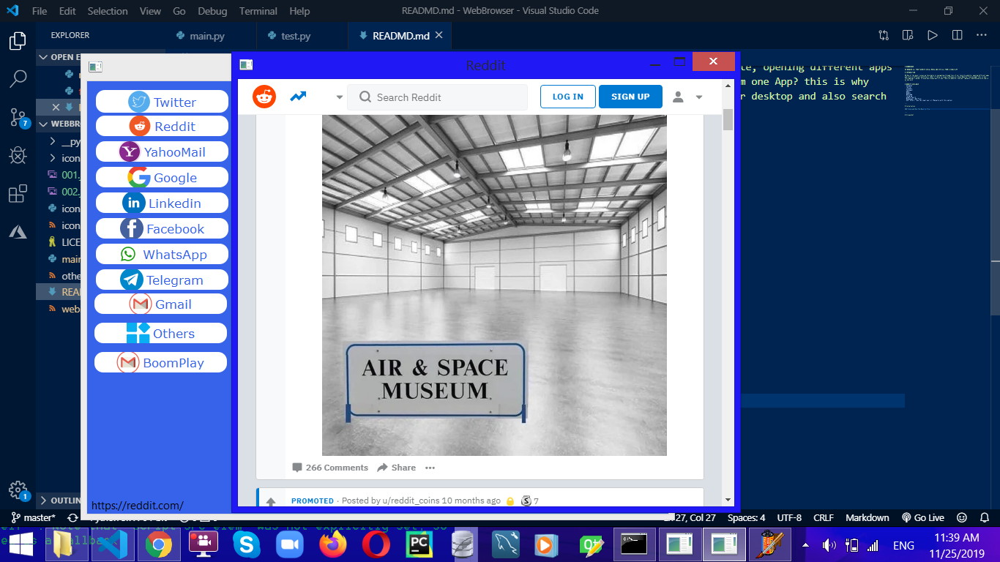
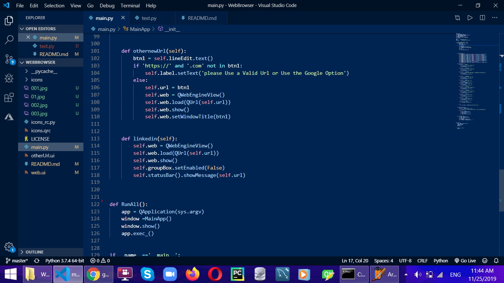
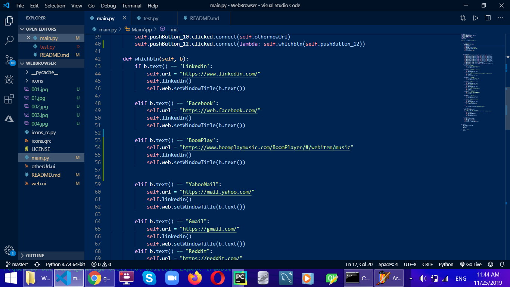

# WEBBROSWER

## BROWSER ALL YOUR FAVORITE SOCIAL MEDIA AND SITE ALL FROM A SINGLE APP

# INTRODUCTION

## One of the major issues we face daily is navigating through tons of our favorite website, opening different apps and site on different platform(s), What if there is a way to Browse all those Website from one App? this is why this app was created, to help you browse most of your favorite website from your laptop or desktop and also search as you wish
---

# WEBSITE AVAILABLE 
- Facebook
- Twitter
- Linkedin
- Yahoomail
- Gmail
- Reddit 
- WhatsApp
- Telegram
- Google Search
- Boomplayer (Web Play)
- And 'Others' (you can input your url Manually with this option)

---

# Installation

### Clone and Run the Main.py file 

---

# Screenshot

- 
- 
- 
- 
- 
- 

More features will be added on Demand, Thanks for using

## Enjoy